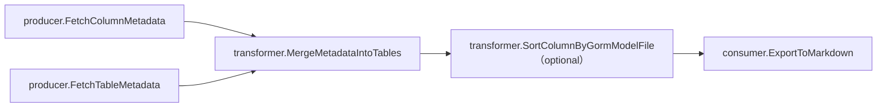

# royleのプログラムについて

## パイプラインアーキテクチャの採用理由

このアプリケーションの目的は、データベース内の様々なデータをドキュメント化することだ。特定のテーブルやカラムの情報だけをドキュメント化するわけではない。パイプラインアーキテクチャーを採用した理由は、ターミナルのように複数のコマンドをつなぎ合わせて様々な表現ができる点を応用するためだ。これにより、様々なSQLやデータ成形関数、データ出力フォーマットを組み合わせることで、データベース内の多種多様なデータをドキュメント化できるようにしている。

## 概要 
主な流れは下のようになる。[統合テスト](https://github.com/digeon-inc/royle/blob/main/integration_test/integration_test.go)で実際の流れを見ればより具体的に理解できる。

各フィルターの役割は以下のようになる。

### producer（データの生成器）

#### FetchColumnMetadata

FetchColumnMetadataでは、**カラム**についての情報をmysqlデータベースのスキーマであるinformation_schemaからsqlを使って取得している。

### FetchTableMetadata

FetchTableMetadataでは、**テーブル**についての情報をmysqlデータベースのinformation_schemaからsqlを使って取得している。

### transformer（データの変換器）

#### MergeMetadataIntoTables

MergeMetadataIntoTablesでは、FetchColumnMetadataとFetchTableMetadataから取得したテーブルとカラムについての情報をカラム名をkeyとして結合している。単一のsqlでテーブル情報とカラム情報を結合しなかった理由は、メンテナンス性が下がるからだ。単一のsqlでやってしまうとどうしても文が長くなり、単一責任の原則にも反してまい可読性が悪化する。

#### SortColumnByGormModelFile (optional)

SortColumnByGormModelFileでは指定されたディレクトリ（複数可）内のファイル（複数可）に宣言されたgormのmodel（複数可）を読み込み、そのモデルのカラム順になるようにカラムをソートする。モデルで宣言されてないカラム(データベース内だけに存在するカラム)はソートされたカラムの後に追加される。また、モデルがないテーブルのカラムはソートされない。

### consumer（データの表示器）

#### ExportToMarkdown

MergeMetadataIntoTablesで変換したデータをmarkdown形式で出力する。出力先は標準出力である。
